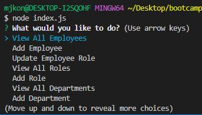
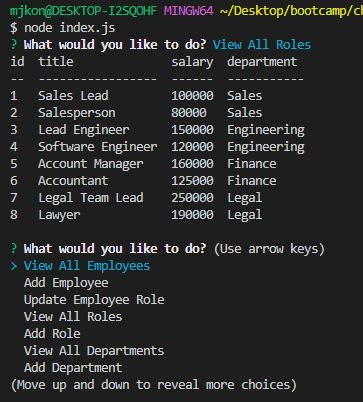

# Employee Tracker

## Description
This repo contains code for challenge 12 of the bootcamp. For this challenge we needed to create a CLI app to track employees in a database. This week we learned the fundamentals SQL and the motivation for this challenge was to get practice interacting with a database using mysql2. Using the command line, the user can interact with the database through various prompts.

## Installation
To install the necessary dependencies, run `npm i` in the command line.

## Video Link
[Link to app demonstration](https://app.castify.com/view/c0ffe6d3-1944-417a-8055-adb9b86773a2)

## Usage

- To begin using the app, log into mysql using the command `mysql -u root -p` 
- To create the database run `source db/schema.sql` 
- This app also contains a seeds file which can be accessed by running `source db/seeds.sql`

>Start the app by running `node index.js` in the command line. 
>This will start inquirer and show the different actions that can be done using the app. 
> 

>Use the arrow keys to navigate the menu and select the actions. 
>The app then displays the information in the terminal. 
> 

## License
MIT license. Please refer to the license in the repo.